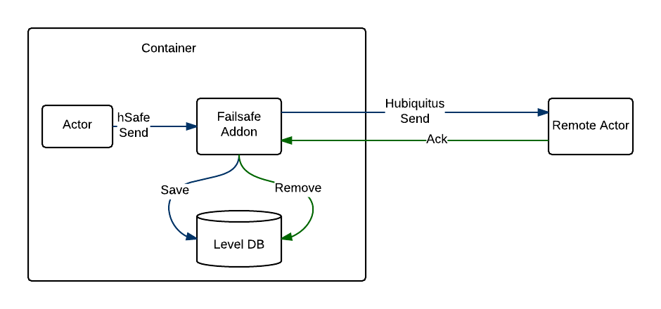

# Hubiquitus-failsafe

Hubiquitus-failsafe persists messages before sending them and keeps them until remote actors acknowledge it.

Messages are stored in a local database (backed by leveldb).

In case remote container/actor crashes, messages are replayed if no acknowledgement is received within sendTimeout (120s by default).

After a max timeout (600s by default) messages are sent to a deadQueue actor (backed by a mongodb database).

In case local actor crashes, messages stored in local db are replayed following previous rules.



## Usage

Add the hubiquitus-failsafe addon and hubiquitus to your package.json

```js
var opts = ({sendTimeout: 300000});  // remote acknowledgement is raised to 300s
var hSafe = require('hubiquitus-failsafe')(opts);

hSafe.send('ping', 'pong', {key: 'value'}, function (err) {
    if (err) console.log('An error occured with safe send :', err);
});
```

## API

### init

```js
require('hubiquitus-failsafe')(opts);
```

Opts should be an object. Available opts are :
* sendTimeout : in ms (120000ms by default). Max time that remote actor can take to acknowledge a message
* maxTimeout : in ms (600000ms by default). Max time until the system sends the message to the deadQueue. (System tries to send the message each time a sentTimeout occurs until the max timeout)
* deadQueue : deadQueue actor id. 'deadQueue' by default.
* maxQueueConcurrentSend : by default 100. On local actor failure, system sends messages stored in the queue concurrently up to this value.
* db : path to localdb. By default process.cwd() + './failsafedb'. This can also be overriden through command line with option --fsdb path/to/db

### send

```js
var hSafe = require('hubiquitus-failsafe')(opts);

hSafe.send(from, to, content, callback);  // callback = function (err) { ... }
```

## Warning

When you use the send method of this addon, you should explicit acknowledge message on the remote end.
If not, message will be sent every sendTimeout until maxTimeout. After max timeout they are sent to the deadQueue actor.

## DeadQueue API

Dead Queue Actor will collect messages that excedeed maxTimeout and couldn't be sent.

### usage

To add the deadQueue actor :

```js
var deadQueue = require('hubiquitus-failsafe').deadQueue;

var deadQueue = deadQueue(opts);
```

Opts should be an object. Available opts are :
* mongo : mongo url (by default : mongodb://localhost:27017/failsafe)
* collection : collection used to store messages (by default : deadQueue)
* deadQueue : Actor id (by default : deadQueue).

## Monitoring

If used with the hubiquitus-ping addon, deadQueue infos can be seen using the url PING_MONITOR_URL/addons.

This addon adds a local actor with the name CONTAINER_ID:failsafe:monitoring that can be queried to get the same info relayed to the hubiquitus-ping addon.
